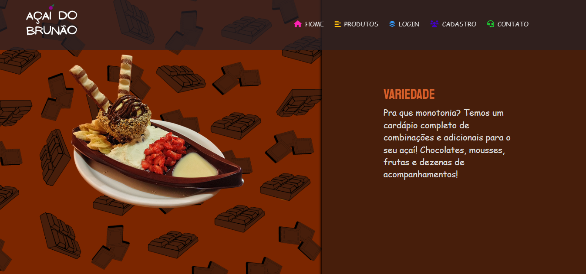

<h1 align="center">Loja de açaí 🍨</h1>

Página web de uma loja de açaí fictícia 

  <a href="#-sobre">Sobre</a>&nbsp;&nbsp;&nbsp;|&nbsp;&nbsp;&nbsp;
  <a href="#-tecnologias">Tecnologias</a>&nbsp;&nbsp;&nbsp;|&nbsp;&nbsp;&nbsp;
  <a href="#-projeto">Projeto</a>&nbsp;&nbsp;&nbsp;&nbsp;&nbsp;&nbsp;

  

 

## ❓ Sobre

Projeto criado para um trabalho em grupo de desenvolvimento de uma página web para a disciplina de Laboratório de Programação III do Curso Técnico em Informática Integrado ao Ensino Médio do IFTM, o qual foi realizado no ano de 2022. A página em questão é sobre uma loja de açaí fictícia, em que eu estive responsável principalmente pelo FrontEnd.  <b>Atenção:</b> Todas as informações inseridas no layout referentes à existência da loja são fictícias. 
<b>Obs:</b> Esta página não é responsiva. Este foi um dos meus primeiros trabalhos FrontEnd, o qual eu fiz com o objetivo de aprender a utilizar as tecnologias.  

---

## 🚀 Tecnologias

O projeto foi desenvolvido com as seguintes tecnologias:

- JavaScript
- HTML
- CSS
- JQuery
---
## 💻 Projeto

- [Visite o projeto online](https://nathaliabeatriz.github.io/loja-de-acai/)

---